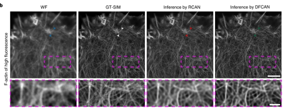

# Cell Generation and low-high-resolution microscope image transformation

## Ⅰ. Cell Generation

* Using one cell image to get encoder for generate new cell image. This project is just started, but is very important  for biology cell imaging.

* Using Variational Autoencoder（VAE）、Deep Convolutional GAN（DCGAN）.

  * After train by 10000 epochs, new cell can be generated like this.

  

  

  

## Ⅱ. low-high-resolution microscope image transformation

* Using super resolution GAN（SRGAN）based、and also try Deep Fourier channel attention networks（DFCAN）.

