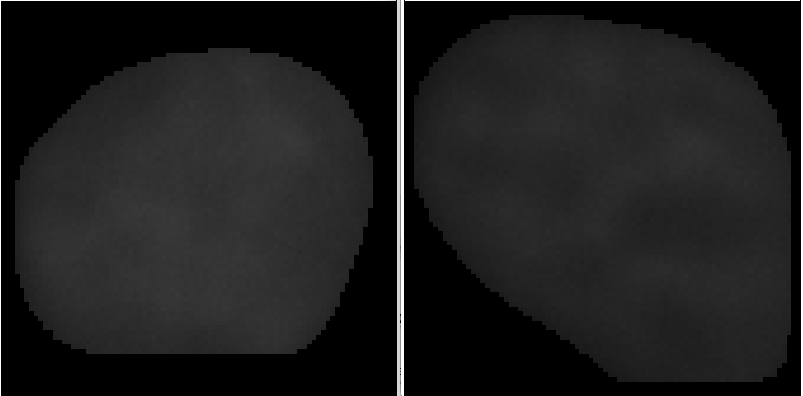
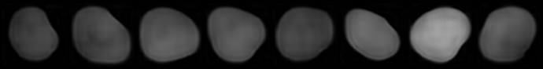
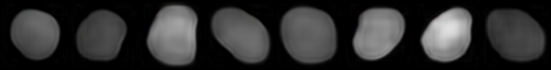
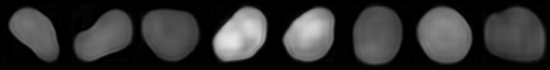
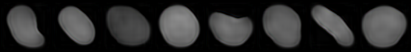

# Cell Generation

* Using one cell image to get encoder for generate new cell image. This project is just started, but is very important  for biology cell imaging.

* Using VAE and GAN.

* Origin cell image is like this.

  * 
  * After train by 10000 epochs, new cell can be generated like this.

  

  

  

  

  

  